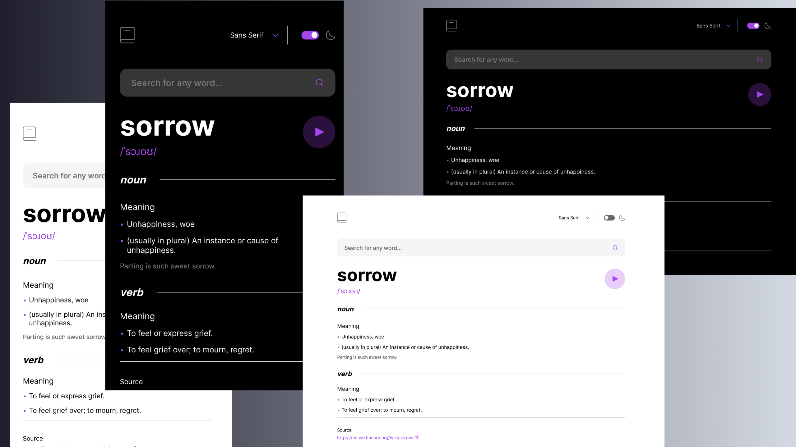

# 📖 Dictionary Web App

A sleek, fully responsive Dictionary web application built using **React** that allows users to look up the definition, phonetics, and audio pronunciation of any English word. This project was a coding challenge by [Frontend Mentor](https://www.frontendmentor.io/challenges/dictionary-web-app-h5wwnyuKFL), aimed at practicing API integration, theming, and responsive layouts.

🔗 **Live Site**: [dictionary-gamma-wine.vercel.app](https://dictionary-gamma-wine.vercel.app/)

---

## 🚀 Features

- 🔍 Search for any English word
- 🧠 Displays definitions, examples, synonyms, and phonetics
- 🔊 Listen to pronunciation audio
- 🌙 Toggle between **light and dark mode**
- 📱 Fully responsive design (mobile-first)
- 🎨 Clean and accessible UI
- ✅ Input validation and error handling

---

## 🛠 Tech Stack

- **React** with functional components
- **CSS** for custom styling
- **JavaScript** ES6+
- **Free Dictionary API** (`https://dictionaryapi.dev/`)
- **Deployed on Vercel**

---
## 📸 Preview



---

## 🧩 Upcoming Improvements

- Add a font switching dropdown
- Add search history or recent words
- Better support for multiple phonetics and audio sources
- Improve loading states and transitions

---

## ✨ Credits

- Challenge by [Frontend Mentor](https://www.frontendmentor.io/challenges/dictionary-web-app-h5wwnyuKFL)
- Audio & definitions from [Free Dictionary API](https://dictionaryapi.dev/)

---

## 📦 Installation

Clone the repo and run it locally:

```bash
git clone https://github.com/ifaixal/Dictionary.git
cd dictionary-app
npm install
npm run dev
